# 🚗 HS Automoveis - Sistema de Venda de Veículos

> **Sistema web para gerenciamento e visualização de veículos**, desenvolvido em **Laravel** com autenticação de usuário.


---

## 📋 Descrição Geral

Aplicação Laravel com autenticação de usuário e senha que simula um site de venda de veículos. O sistema possui **duas áreas distintas**:

- **🌐 Área Pública**: Onde visitantes podem visualizar todos os veículos disponíveis para venda
- **🔐 Área Administrativa**: Restrita ao administrador autenticado, para gerenciar marcas, modelos, cores e veículos

---

## ✨ Funcionalidades Principais

### 🌐 Área Pública

- ✅ **Listagem de Veículos**: Exibe todos os veículos cadastrados com informações principais
- ✅ **Detalhes do Veículo**: Clique em um veículo para ver todas as informações e galeria de fotos
- ✅ **Busca e Filtros**: Busque por marca, modelo ou filtre por ano e preço
- ✅ **Galeria de Imagens**: Visualize múltiplas fotos de cada veículo
- ✅ **Informações Completas**: Marca, modelo, cor, ano, quilometragem, valor e descrição

### 🔐 Área Administrativa

- ✅ **Autenticação**: Login seguro com email e senha
- ✅ **Gerenciamento de Marcas**: CRUD completo (Criar, Ler, Atualizar, Deletar)
- ✅ **Gerenciamento de Modelos**: Vincule modelos a marcas
- ✅ **Gerenciamento de Cores**: Cadastre cores disponíveis
- ✅ **Gerenciamento de Veículos**: CRUD completo com validações
- ✅ **Galeria de Fotos**: Adicione até 3+ fotos por veículo (via URLs)
- ✅ **Dashboard**: Painel administrativo intuitivo

---

## 🚀 Como Rodar o Projeto

### Pré-requisitos

- **PHP** >= 8.2
- **Composer** (gerenciador de dependências PHP)
- **MySQL** >= 8.0 (ou MariaDB)
- **Git** (para clonar o repositório)

### Passo 1: Clonar o Repositório

```bash
# Via HTTPS
git clone https://github.com/hugosbss/hs-automoveis.git
cd hs-automoveis

# Ou via SSH
git clone git@github.com:hugosbss/hs-automoveis.git
cd hs-automoveis
```

### Passo 2: Instalar Dependências

```bash
# Instalar dependências PHP
composer install

# Instalar dependências Node.js (para assets)
npm install
```

### Passo 3: Configurar o Arquivo .env

```bash
# Copiar o arquivo de exemplo
cp .env.example .env
```

O arquivo `.env.example` já vem com as configurações básicas. Você pode ajustar conforme necessário:

```env
# Configurações da Aplicação
APP_NAME=Laravel
APP_ENV=local
APP_KEY=base64:...
APP_DEBUG=true
APP_URL=http://localhost:8000

# Configurações do Banco de Dados
DB_CONNECTION=mysql
DB_HOST=127.0.0.1
DB_PORT=3306
DB_DATABASE=hs_automoveis
DB_USERNAME=root
DB_PASSWORD=
```

### Passo 4: Gerar Chave da Aplicação

```bash
php artisan key:generate
```

### Passo 5: Executar Migrations

```bash
# Criar as tabelas no banco de dados
php artisan migrate
```

Isso criará as seguintes tabelas:

| Tabela | Descrição |
|--------|-----------|
| `users` | Usuários do sistema (administradores) |
| `marcas` | Marcas de veículos (Toyota, Honda, etc) |
| `modelos` | Modelos de veículos (Corolla, Civic, etc) |
| `cores` | Cores disponíveis (Branco, Preto, etc) |
| `veiculos` | Veículos cadastrados |
| `foto_veiculos` | Fotos dos veículos |

### Passo 6: Popular o Banco de Dados (Seeders)

```bash
# Executar todos os seeders
php artisan db:seed

# Ou executar um seeder específico
php artisan db:seed --class=MarcasSeeder
php artisan db:seed --class=ModelosSeeder
php artisan db:seed --class=CoresSeeder
php artisan db:seed --class=VeiculosSeeder
php artisan db:seed --class=FotoVeiculosSeeder
```

### Passo 7: Compilar Assets (Opcional)

```bash
# Compilar CSS e JavaScript
npm run dev

# Ou para produção
npm run build
```

### Passo 8: Iniciar o Servidor

```bash
# Iniciar servidor de desenvolvimento
php artisan serve
```

O servidor estará disponível em: **http://localhost:8000**
---

## 📸 Screenshots das Telas

### 🏠 Página Inicial - Home (Parte 1)

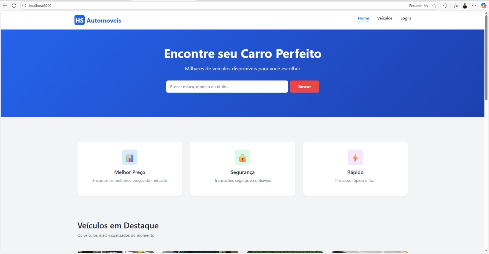

Primeira seção da página inicial com:
- Banner principal com busca
- Navegação do site
- Introdução ao sistema

### 🏠 Página Inicial - Home (Parte 2)


Segunda seção com:
- Veículos em destaque
- Cards informativos
- Chamadas para ação

### 🏠 Página Inicial - Home (Parte 3)

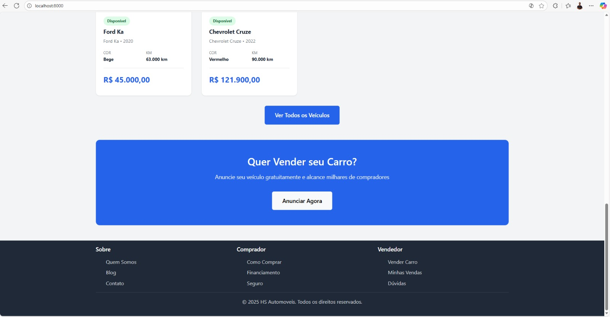

Terceira seção com:
- Mais veículos em destaque
- Rodapé do site
- Informações adicionais

### 🚗 Listagem de Veículos

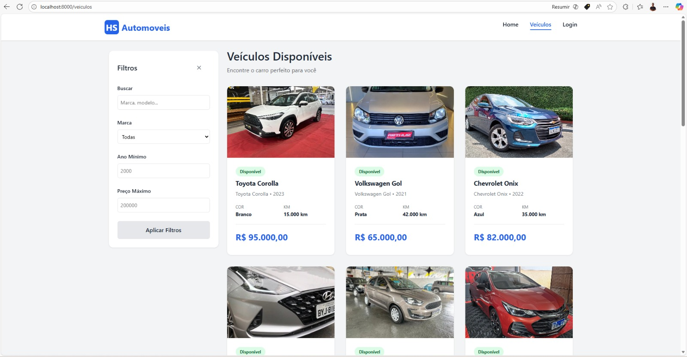

Página de listagem com:
- Todos os veículos cadastrados
- Informações principais (marca, modelo, ano, preço)
- Foto principal de cada veículo
- Layout responsivo

### 🔍 Filtro de Veículos

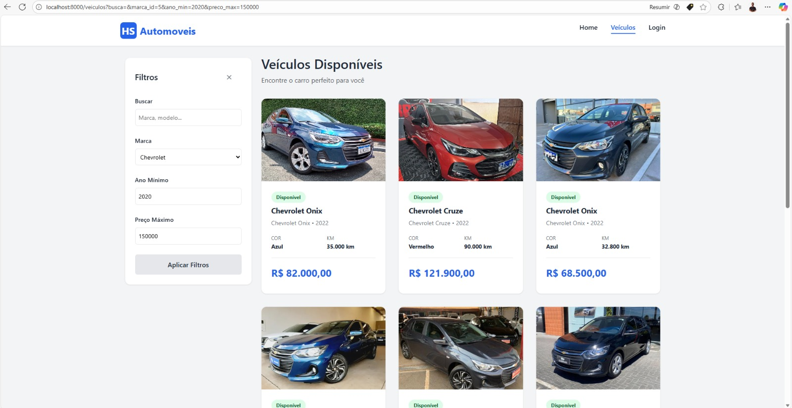

Sistema de filtros com:
- Filtro por marca
- Filtro por ano
- Filtro por preço
- Busca em tempo real

### 📋 Detalhes do Veículo

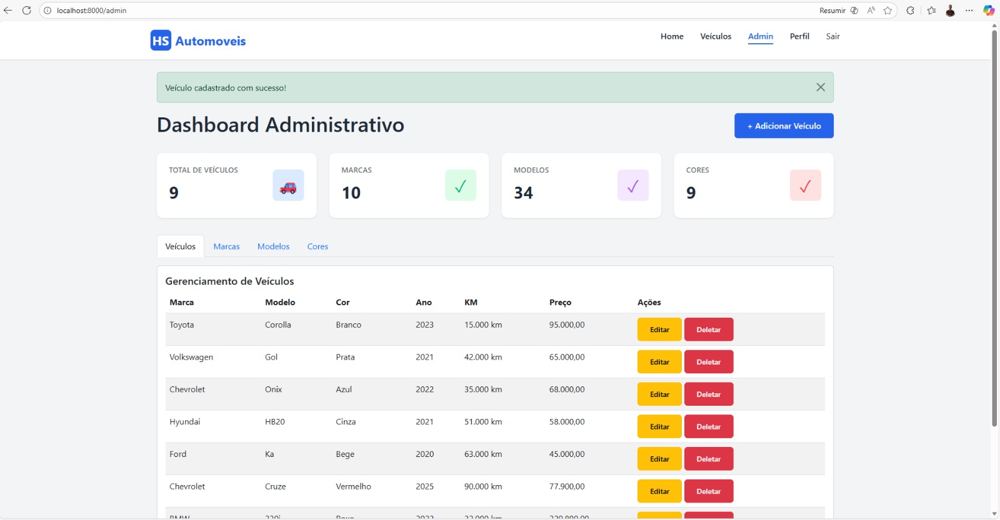

Página de detalhes com:
- Galeria de fotos do veículo
- Informações completas
- Descrição detalhada
- Veículos similares

### 🚙 Veículos Similares

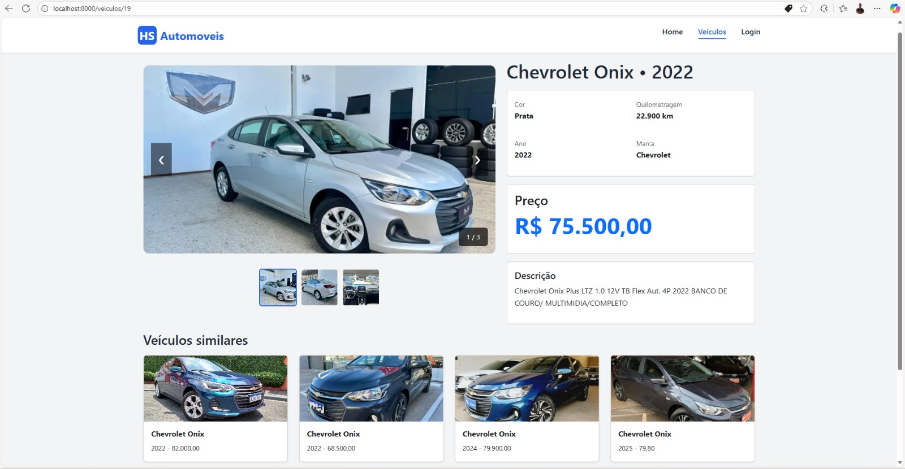

Seção de recomendações com:
- Veículos da mesma marca
- Veículos com características similares
- Links para detalhes

---

## 🔐 Área Administrativa

### 🔑 Login do Administrador

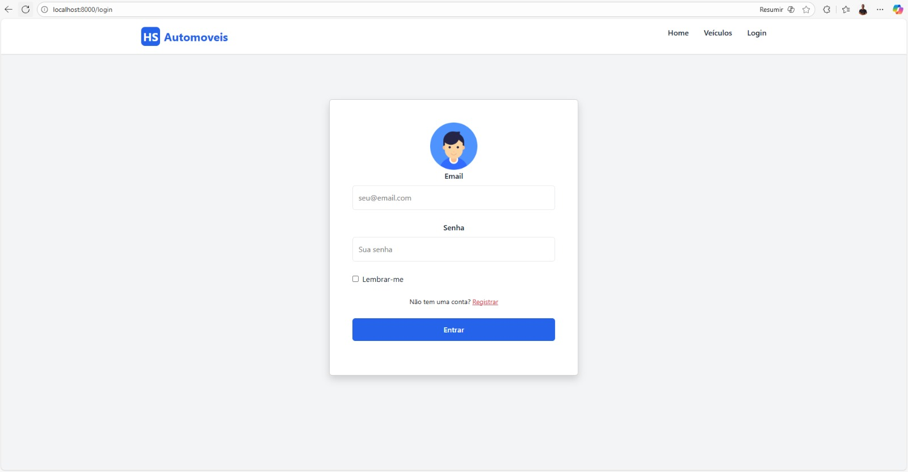

Tela de autenticação com:
- Campo de email
- Campo de senha
- Botão de login
- Validação de credenciais

### 👤 Perfil do Administrador

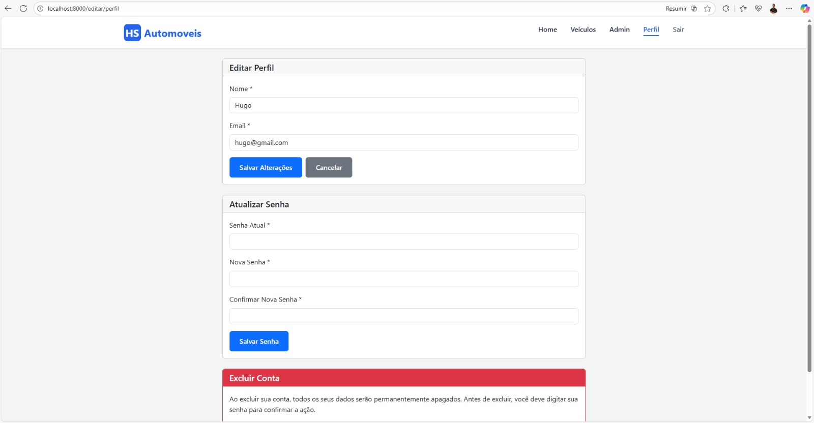

Página de perfil com:
- Informações do usuário
- Opções de edição
- Dados pessoais
- Configurações da conta

### ℹ️ Informações do Perfil


Detalhes do perfil do administrador com:
- Nome do usuário
- Email
- Data de criação
- Opções de segurança

---

## 📊 Gerenciamento de Marcas

### 📝 Lista de Marcas

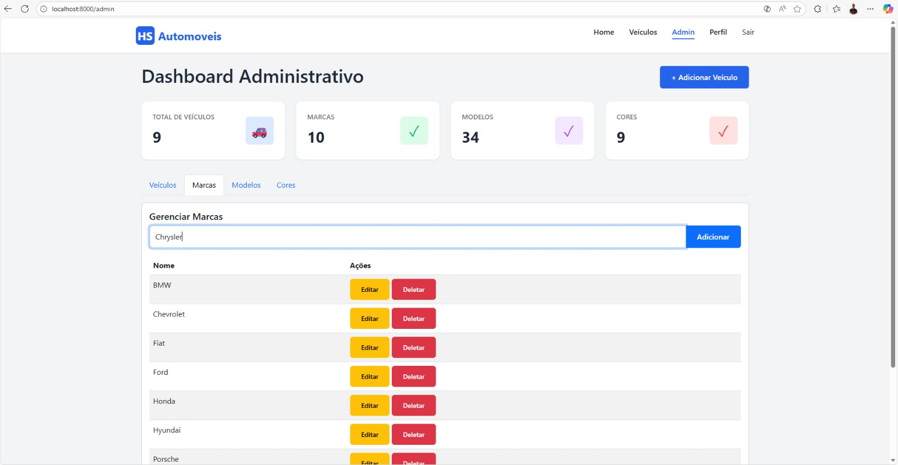

Tabela de marcas com:
- Todas as marcas cadastradas
- Botões de editar e deletar
- Opção de adicionar nova marca
- Busca e filtros

### ➕ Cadastro de Marca

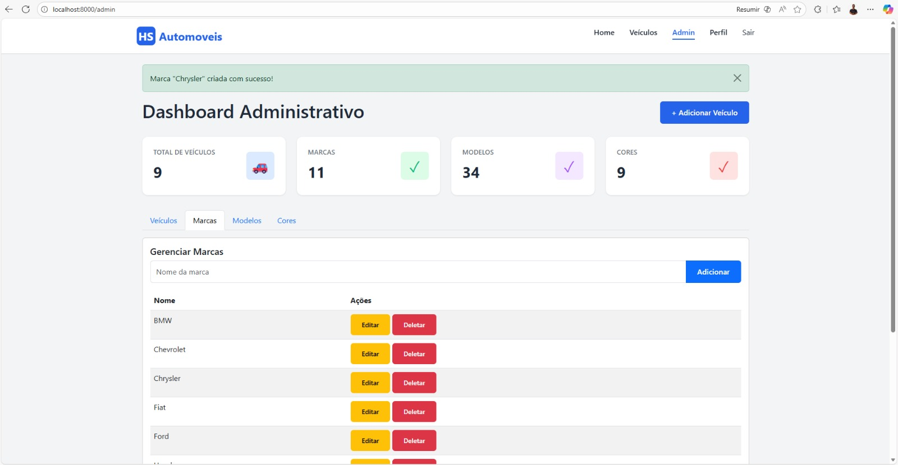

Formulário para adicionar marca com:
- Campo de nome
- Validação de dados
- Botão de salvar
- Mensagens de sucesso/erro

---

## 📊 Gerenciamento de Modelos

### 📝 Lista de Modelos

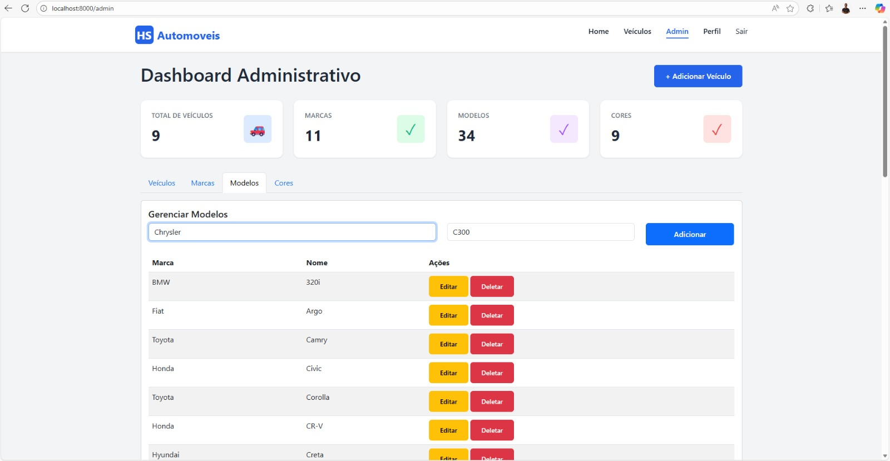

Tabela de modelos com:
- Todos os modelos cadastrados
- Marca associada
- Botões de editar e deletar
- Opção de adicionar novo modelo

### ➕ Cadastro de Modelo

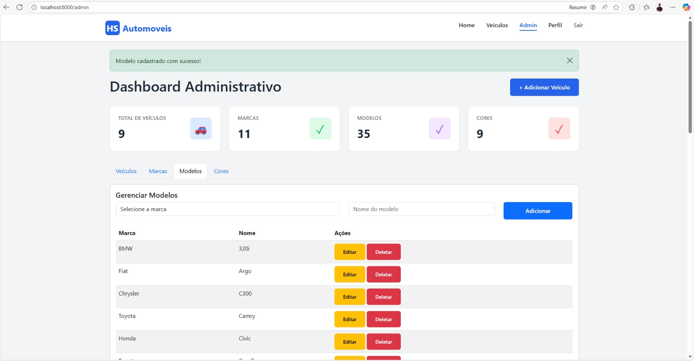

Formulário para adicionar modelo com:
- Campo de nome
- Seleção de marca
- Validação de dados
- Botão de salvar

---

## 🎨 Gerenciamento de Cores

### ➕ Cadastro de Cor

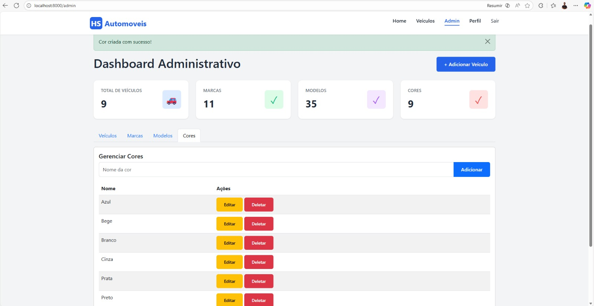

Formulário para adicionar cor com:
- Campo de nome da cor
- Validação de dados
- Botão de salvar
- Mensagens de feedback

---

## 🚗 Gerenciamento de Veículos

### ➕ Adicionar Veículo

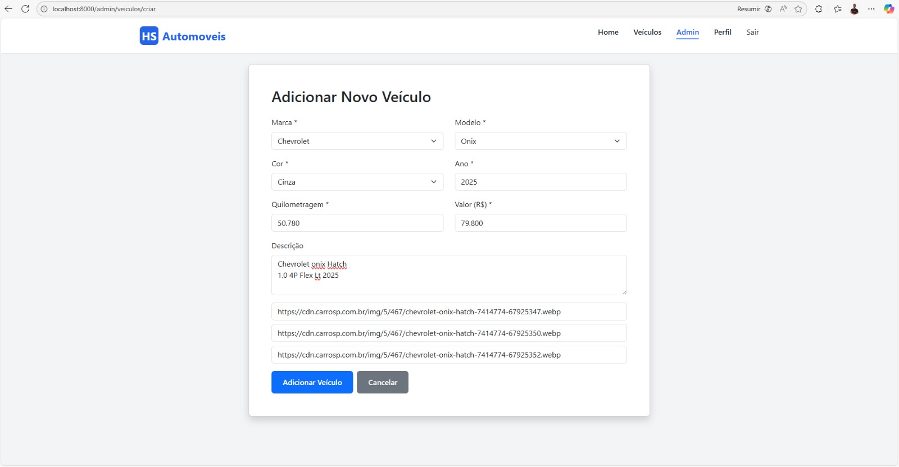

Formulário completo para cadastrar veículo com:
- Seleção de marca
- Seleção de modelo
- Seleção de cor
- Campo de ano (obrigatório)
- Campo de quilometragem (obrigatório)
- Campo de valor (obrigatório)
- Campo de descrição
- Campos para 3+ URLs de fotos
- Validação de campos obrigatórios
- Botão de salvar

---

## 🗂️ Estrutura do Projeto

```
hs-automoveis/
├── app/
│   ├── Http/
│   │   ├── Controllers/
│   │   │   ├── Auth/
│   │   │   │   ├── AuthenticatedSessionController.php
│   │   │   │   ├── RegisteredUserController.php
│   │   │   │   └── PasswordController.php
│   │   │   ├── CorController.php
│   │   │   ├── FotoVeiculoController.php
│   │   │   ├── MarcaController.php
│   │   │   ├── ModeloController.php
│   │   │   ├── VeiculoController.php
│   │   │   └── ProfileController.php
│   │   ├── Middleware/
│   │   └── Requests/
│   └── Models/
│       ├── User.php
│       ├── Veiculo.php
│       ├── Marca.php
│       ├── Modelo.php
│       ├── Cor.php
│       └── FotoVeiculo.php
├── database/
│   ├── migrations/
│   │   ├── create_marcas_table.php
│   │   ├── create_cores_table.php
│   │   ├── create_modelos_table.php
│   │   ├── create_veiculos_table.php
│   │   └── create_foto_veiculos_table.php
│   └── seeders/
│       ├── DatabaseSeeder.php
│       ├── MarcasSeeder.php
│       ├── ModelosSeeder.php
│       ├── CoresSeeder.php
│       ├── VeiculosSeeder.php
│       └── FotoVeiculosSeeder.php
├── resources/
│   ├── views/
│   │   ├── layouts/
│   │   │   └── template.blade.php
│   │   ├── auth/
│   │   │   ├── login.blade.php
│   │   │   └── register.blade.php
│   │   ├── template-wmotors/
│   │   │   ├── home.blade.php
│   │   │   ├── veiculoLista.blade.php
│   │   │   ├── veiculoDetalhe.blade.php
│   │   │   └── administrador.blade.php
│   │   └── profile/
│   │       └── edit.blade.php
│   ├── css/
│   │   └── app.css
│   └── js/
│       └── app.js
├── routes/
│   ├── web.php
│   └── auth.php
├── public/
│   ├── css/
│   ├── js/
│   └── images/
├── config/
├── bootstrap/
├── storage/
├── tests/
├── .env.example
├── .gitignore
├── composer.json
├── package.json
└── README.md
```

---

## 🔧 Tecnologias Utilizadas

| Tecnologia | Versão | Descrição |
|-----------|--------|-----------|
| **Laravel** | 11.0 | Framework PHP moderno |
| **PHP** | 8.2+ | Linguagem de programação |
| **MySQL** | 8.0 | Banco de dados relacional |
| **Bootstrap** | 5.3 | Framework CSS responsivo |
| **Blade** | - | Motor de templates do Laravel |
| **Eloquent** | - | ORM do Laravel |

---

## 📝 Validações Implementadas

### Campos Obrigatórios

- ✅ **Veículos**: Ano, quilometragem e valor são obrigatórios
- ✅ **Marcas**: Nome é obrigatório
- ✅ **Modelos**: Nome e marca são obrigatórios
- ✅ **Cores**: Nome é obrigatório
- ✅ **Fotos**: URLs válidas (mínimo 3 por veículo)

### Validações de Negócio

- ✅ Ano deve ser um número válido
- ✅ Quilometragem deve ser um número positivo
- ✅ Valor deve ser um número decimal positivo
- ✅ URLs de fotos devem ser válidas
- ✅ Relacionamentos devem existir (marca, modelo, cor)

---

## 🔐 Segurança

### Autenticação

- ✅ Autenticação nativa do Laravel
- ✅ Senhas criptografadas com bcrypt
- ✅ Proteção contra CSRF

### Autorização

- ✅ Apenas usuários autenticados podem acessar a área administrativa
- ✅ Middleware de autenticação em rotas protegidas
- ✅ Validação de permissões

---

## 📚 Recursos Laravel Utilizados

- ✅ **Autenticação**: Laravel Auth (login, registro, logout)
- ✅ **Roteamento**: Routes com middlewares
- ✅ **Controllers**: MVC pattern
- ✅ **Models**: Eloquent ORM com relacionamentos
- ✅ **Migrations**: Versionamento do banco de dados
- ✅ **Seeders**: População de dados de teste
- ✅ **Validação**: Form Request Validation
- ✅ **Templates**: Blade com @extends, @section e @yield
- ✅ **Relacionamentos**: hasMany, belongsTo, belongsToMany

---

## 🐛 Solução de Problemas

### Erro: "Class not found" ao executar migrations

**Solução**: Execute `composer dump-autoload`

```bash
composer dump-autoload
php artisan migrate
```

### Erro: "SQLSTATE[HY000]: General error"

**Solução**: Verifique as credenciais do banco de dados no `.env`

```bash
# Teste a conexão
php artisan tinker
>>> DB::connection()->getPdo();
```

### Erro de permissões em storage/

**Solução**: Ajuste as permissões dos diretórios

```bash
chmod -R 775 storage bootstrap/cache
```

### Erro: "No application encryption key has been specified"

**Solução**: Gere a chave da aplicação

```bash
php artisan key:generate
```

### Banco de dados não existe

**Solução**: Crie o banco manualmente

```bash
# No MySQL
mysql -u root -p
CREATE DATABASE hs_automoveis;
EXIT;

# Depois execute as migrations
php artisan migrate
```

### Seeders não funcionam

**Solução**: Verifique a ordem de execução

```bash
# Resetar e popular (CUIDADO: apaga todos os dados!)
php artisan migrate:fresh --seed

# Ou execute manualmente na ordem correta
php artisan db:seed --class=MarcasSeeder
php artisan db:seed --class=ModelosSeeder
php artisan db:seed --class=CoresSeeder
php artisan db:seed --class=VeiculosSeeder
php artisan db:seed --class=FotoVeiculosSeeder
```

---

## 🔧 Comandos Úteis

### Gerenciamento de Cache

```bash
# Limpar todos os caches
php artisan cache:clear

# Limpar cache de configuração
php artisan config:clear

# Limpar cache de views
php artisan view:clear

# Limpar tudo
php artisan optimize:clear
```

### Gerenciamento do Banco de Dados

```bash
# Ver status das migrations
php artisan migrate:status

# Reverter última migration
php artisan migrate:rollback

# Reverter todas as migrations
php artisan migrate:reset

# Resetar e popular (CUIDADO!)
php artisan migrate:fresh --seed

# Executar um seeder específico
php artisan db:seed --class=UsersSeeder
```

### Tinker (Shell Interativo)

```bash
# Acessar o shell do Laravel
php artisan tinker

# Criar usuário manualmente
>>> $user = new App\Models\User();
>>> $user->name = 'Admin';
>>> $user->email = 'admin@admin.com';
>>> $user->password = Hash::make('123456');
>>> $user->save();

# Listar usuários
>>> App\Models\User::all();

# Deletar usuário
>>> App\Models\User::find(1)->delete();
```

### Assets

```bash
# Compilar assets em desenvolvimento
npm run dev

# Compilar assets para produção
npm run build

# Watch para mudanças em tempo real
npm run watch
```

---

## 📖 Documentação Adicional

### Seeders

Para mais informações sobre os seeders e como personalizar os dados, consulte o arquivo `GUIA_SEEDERS.md`:

```bash
# Dentro da pasta database/seeders/
cat GUIA_SEEDERS.md
```

### Laravel Documentation

- [Laravel Documentation](https://laravel.com/docs)
- [Laravel Eloquent](https://laravel.com/docs/eloquent)
- [Laravel Blade](https://laravel.com/docs/blade)
- [Laravel Authentication](https://laravel.com/docs/authentication)

---

## 📋 Checklist

- ✅ Desenvolvido em **Laravel**
- ✅ Autenticação de usuário com email e senha
- ✅ Banco de dados **MySQL** configurado e funcional
- ✅ Área pública com listagem e detalhes de veículos
- ✅ Área administrativa restrita a usuários autenticados
- ✅ CRUD completo para marcas, modelos, cores e veículos
- ✅ Validação de campos obrigatórios (ano, quilometragem, valor)
- ✅ Mínimo de 3 fotos por veículo (via URLs)
- ✅ Template visual com Blade (@section, @yield)
- ✅ Uso de Bootstrap para estilização
- ✅ README.md com instruções de execução
- ✅ Credenciais de administrador documentadas
- ✅ Seeders para popular dados automaticamente

---

## 👤 Autor

**Hugo**

---

## 💡 Dicas Importantes

1. **Backup do Banco**: Sempre faça backup antes de executar `migrate:fresh --seed`
2. **Variáveis de Ambiente**: Nunca compartilhe o arquivo `.env` com credenciais reais
3. **Senhas**: Altere as senhas padrão em produção
4. **Imagens**: As URLs das imagens nos seeders são reais e podem mudar

---

## 🤝 Suporte

Se encontrar problemas, verifique:

1. Se o PHP e MySQL estão instalados e rodando
2. Se as dependências foram instaladas (`composer install` e `npm install`)
3. Se o arquivo `.env` está configurado corretamente
4. Se as migrations foram executadas (`php artisan migrate`)
5. Se os seeders foram executados (`php artisan db:seed`)

---

Última atualização: **Novembro de 2025**
